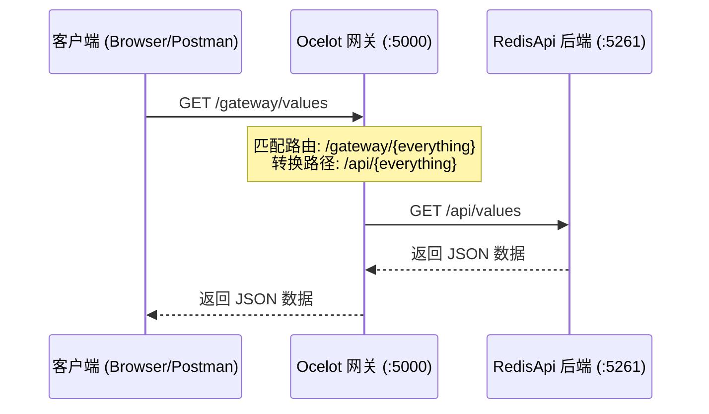
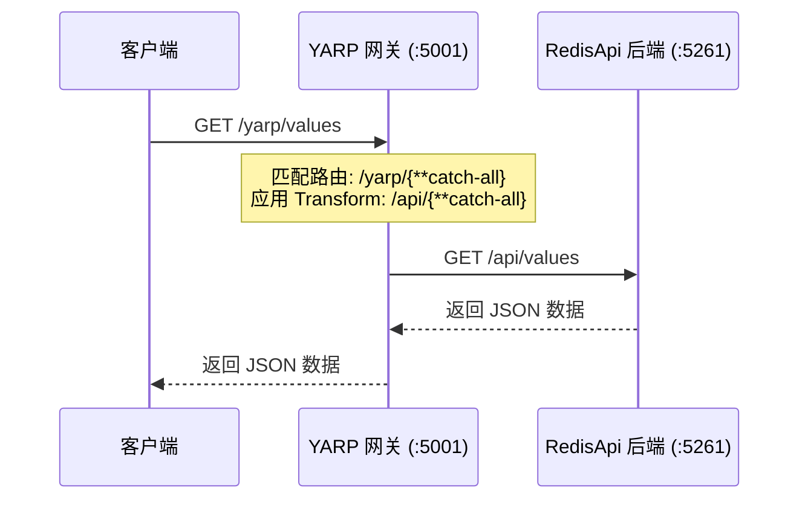

# Ocelot 与 YARP 网关实战演示

为了帮助你更好地理解 Ocelot 和 YARP，我在项目中添加了两个独立的网关示例项目。

## 1. 项目结构

*   `Gateways/OcelotGateway`: 使用 Ocelot 实现的网关。
*   `Gateways/YarpGateway`: 使用 YARP 实现的网关。
*   `RedisApi`: 我们的后端服务 (运行在 `http://localhost:5261`)。

## 2. 运行准备

在开始之前，请确保 **RedisApi** 正在运行，因为网关会将请求转发给它。

```powershell
# 在一个终端中运行 RedisApi
cd RedisApi
dotnet run
```

## 3. Ocelot 网关演示

Ocelot 是基于配置文件的网关。

### 3.1 启动 Ocelot
```powershell
# 在另一个终端中运行 OcelotGateway
cd Gateways/OcelotGateway
dotnet run
```
Ocelot 网关将启动在 `http://localhost:5000`。

### 3.2 测试路由
我们在 `ocelot.json` 中配置了如下路由规则：
*   **上游 (网关入口)**: `/gateway/{everything}`
*   **下游 (后端服务)**: `/api/{everything}`

**测试请求**:
访问网关地址：`http://localhost:5000/gateway/values`

**Ocelot 转发流程**:


**预期结果**:
Ocelot 会将请求转发到 `http://localhost:5261/api/values`，你应该能看到 RedisApi 返回的数据。

## 4. YARP 网关演示

YARP 是微软官方的高性能反向代理。

### 4.1 启动 YARP
```powershell
# 在另一个终端中运行 YarpGateway
cd Gateways/YarpGateway
dotnet run
```
YARP 网关将启动在 `http://localhost:5001`。

### 4.2 测试路由
我们在 `appsettings.json` 中配置了如下路由规则：
*   **匹配路径**: `/yarp/{**catch-all}`
*   **转换路径**: `/api/{**catch-all}`

**测试请求**:
访问网关地址：`http://localhost:5001/yarp/values`

**YARP 转发流程**:


**预期结果**:
YARP 会将请求转发到 `http://localhost:5261/api/values`，你应该能看到 RedisApi 返回的数据。

## 5. 关键配置对比

### Ocelot (`ocelot.json`)
```json
{
  "Routes": [
    {
      "DownstreamPathTemplate": "/api/{everything}",
      "DownstreamScheme": "http",
      "DownstreamHostAndPorts": [ { "Host": "localhost", "Port": 5261 } ],
      "UpstreamPathTemplate": "/gateway/{everything}",
      "UpstreamHttpMethod": [ "Get", "Post", "Put", "Delete" ]
    }
  ]
}
```

### YARP (`appsettings.json`)
```json
"ReverseProxy": {
  "Routes": {
    "route1": {
      "ClusterId": "cluster1",
      "Match": { "Path": "/yarp/{**catch-all}" },
      "Transforms": [ { "PathPattern": "/api/{**catch-all}" } ]
    }
  },
  "Clusters": {
    "cluster1": {
      "Destinations": { "destination1": { "Address": "http://localhost:5261/" } }
    }
  }
}
```

通过这两个示例，你可以直观地感受到：
*   **Ocelot** 更偏向于传统的 API 网关配置风格，强调 Upstream 和 Downstream 的映射。
*   **YARP** 更偏向于反向代理的配置风格，强调 Route (路由) 和 Cluster (集群) 的概念，这与 Nginx 或 Envoy 的概念非常相似。
